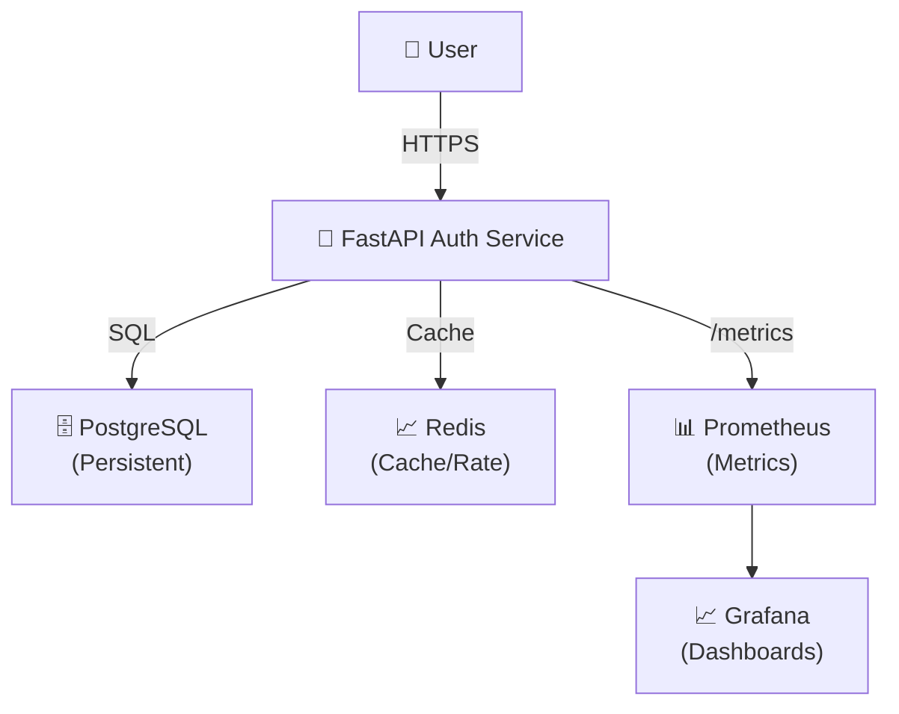

## 🚀 Auth System (Production-Grade Backend with Kubernetes, CI/CD & Observability)

A **production-ready authentication system** built using **FastAPI**, deployed on **Kubernetes**, with **CI/CD automation**, **secure secret management**, and **full observability (Prometheus + Grafana)**.

---

## 🏷️ Badges

<p align="center">
  
  
  
  
  
</p>

---

## 🧠 What This Project Demonstrates

- ✔ Production-grade backend architecture  
- ✔ Secure authentication system (multi-method login)  
- ✔ Kubernetes-based deployment  
- ✔ CI/CD automation (GitHub Actions)  
- ✔ Observability (metrics + dashboards)  
- ✔ Scalable and fault-tolerant design  

---

## 🚀 Features

* 🔐 **JWT Authentication (RS256)** — Secure token-based auth using asymmetric keys
* 🌐 **OAuth Login** — Google & GitHub integration
* ✉️ **Magic Link Authentication** — Passwordless login via email
* 📱 **Phone OTP Login** — Twilio-ready SMS-based authentication
* 🔑 **2FA (TOTP + Recovery Codes)** — Multi-factor authentication for enhanced security
* 🛡️ **WebAuthn (Passkeys)** — Modern passwordless authentication using biometrics/security keys
* ⚡ **Rate Limiting (Redis)** — Prevent abuse & brute-force attacks
* 🧠 **Device Fingerprinting** — Detect and track user devices for security insights
* 📊 **Observability** — Metrics exposed via `/metrics` for Prometheus
* 🧪 **Health Checks** — `/health`, `/live`, `/ready` endpoints for reliability

---

## 🧠 Key Highlights

* ☸️ Kubernetes-based deployment with scalability
* 🔄 CI/CD pipeline using GitHub Actions
* 🔒 Secure secret management using Kubernetes Secrets
* ⚡ Redis-backed caching and rate limiting
* 🗄️ PostgreSQL with persistent storage (PVC)
* 📊 Monitoring with Prometheus & Grafana

---

## 📸 System Architecture




---

# 🛠️ Tech Stack

**Production Technologies**

- **Backend:** FastAPI, SQLAlchemy
- **Database:** PostgreSQL
- **Cache:** Redis
- **Auth:** JWT, OAuth, OTP, WebAuthn
- **DevOps:** Docker, Kubernetes, GitHub Actions
- **Monitoring:** Prometheus, Grafana
---

## 📁 Project Structure
auth-service/
    │
    ├── app/ ---------> Application code
    ├── k8s/ --------->           Kubernetes manifests
    ├── keys/  --------->         JWT keys (NOT committed)
    ├── .github/workflows/   ---------> CI/CD pipelines
    ├── Dockerfile
    ├── docker-compose.yml
    ├── requirements.txt
    ├── requirements-dev.txt
    └── .env.example

--- 
## ⚙️ Local Setup (Docker Compose)

**Clone repo**
```bash  
git clone https://github.com/yourusername/auth-service.git
cd auth-service
``` 
**Setup environment**
```bash
cp .env.example .env.development
``` 
Update values as needed.

**Generate JWT keys**
```bash
mkdir -p keys
openssl genrsa -out keys/private.pem 2048
openssl rsa -in keys/private.pem -pubout -out keys/public.pem
``` 

**Run services**
```bash
docker-compose up --build
```

---

## ☸️ Kubernetes Deployment

**Apply all resources:**
```bash
kubectl apply -f k8s/
``` 

**Verify:**
```bash
kubectl get pods
kubectl get svc
```

**Access API:**
```bash
curl http://<node-ip>:30007/health
```
--- 

## 🔄 CI/CD Pipeline

Automated using **GitHub Actions**

### Workflow

**1.** Push code
**2.** Run tests
**3.** Build Docker image
**4.** Push to DockerHub
**5.** Deploy to Kubernetes

--- 

## 🔐 Security Design

**Key Security Measures**

- Kubernetes Secrets for sensitive data
- JWT keys mounted as read-only volumes
- No secrets committed to repository
- Rate limiting + multi-factor authentication

--- 

## 📊 Observability

**Monitoring & Visualization**

- **Prometheus**
  - Scrapes /metrics
  - Tracks latency, throughput
- **Grafana**
  - Real-time dashboards
  - System health visualization

--- 

## 🧪 Health Endpoints

**Health Check Endpoints**

| Endpoint | Purpose              |
|----------|----------------------|
| `/health` | Basic health        |
| `/live`   | Liveness probe      |
| `/ready`  | Dependency check    |
| `/metrics`| Prometheus metrics  |

--- 

## 📌 API Example

**POST /auth/login**

**Request:**
```json
{
  "email": "user@example.com",
  "password": "securepassword"
}
```

**Response:**
```json
{
  "access_token": "jwt_token",
  "refresh_token": "refresh_token"
}
```
--- 

## 🧠 Engineering Learnings

**Key Technical Takeaways**

- Designing secure authentication systems
- Kubernetes service orchestration
- CI/CD pipelines in real-world workflows
- Observability in distributed systems
- Backend scalability patterns

--- 

## 🚀 Future Enhancements

**Planned Improvements**

- HTTPS with Ingress Controller
- Horizontal Pod Autoscaler (HPA)
- Helm Charts
- Canary Deployments

--- 

## 👨‍💻 Author

**Santosh Kumar Bharty**  
*Backend Engineer | Python | FastAPI | System Design*

--- 

## 💼 Recruiter Highlights

**Production-Ready System**

✔ Production-ready backend system  
✔ Multi-auth strategy (JWT + OAuth + WebAuthn)  
✔ Kubernetes + CI/CD + Observability  
✔ Security-first architecture  

**🎯 Ideal Roles**  
Backend / Platform / Distributed Systems

---

## ⭐ Support

**If you found this useful:**

- ⭐ Star this repo
- 🔁 Share with others  
- 💡 Fork and build on it
