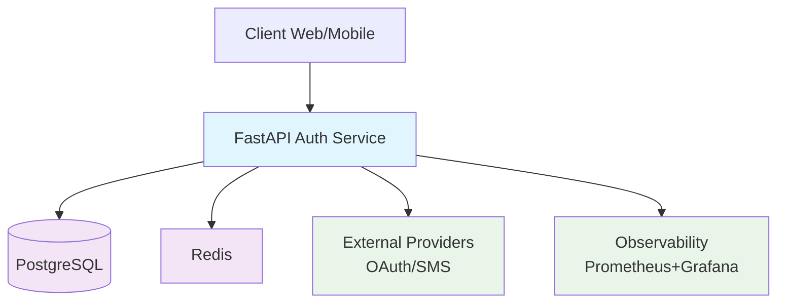
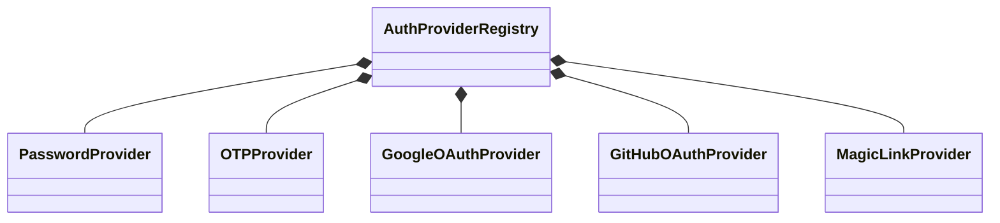
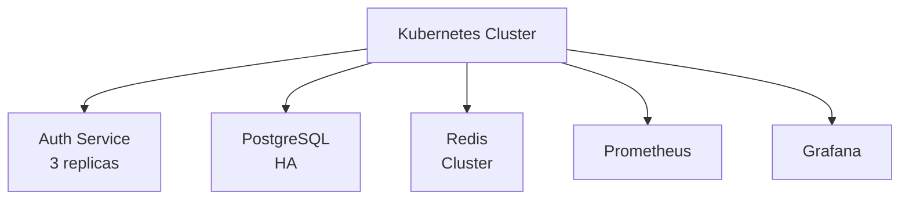

# 🏗️ High-Level Design (HLD) — Auth Service

## 📌 Overview
This Auth Service is a **production-grade Identity & Access Management (IAM)** system built with **FastAPI**.  
It supports multiple authentication mechanisms, MFA, OAuth, RBAC, and observability.

## 🧱 System Architecture

## 🧩 Components Breakdown

### 1. API Layer (`app/api`)
**Purpose:** Handles all incoming HTTP requests  
**Endpoints:**
- `/login`, 
- `/register`, 
- `/refresh`
- `/oauth/{provider}/callback`
- `/2fa/login`, 
- `/2fa/verify`

**Key Features:**
- Dependency injection (`Depends()`)
- Swagger/OpenAPI docs
- Rate limiting middleware

### 2. Service Layer (`app/services`)
**Purpose:** Business logic orchestration  
**Core Services:**
| Service | Responsibility |
|---------|----------------|
| `AuthService` | Core auth flows |
| `OTPService` | OTP generation/verification |
| `MFAChallengeService` | 2FA token management |
| `RBACService` | Permission checks |
| `SessionService` | Device/session mgmt |

### 3. Repository Layer (`app/repositories`)
**Purpose:** Data access abstraction  
**Repositories:**
- `UserRepository`
- `SessionRepository`
- `TokenRepository`
- `OAuthRepository`
- `AuditRepository`

### 4. Data Layer

| Component | Purpose | Schema |
|-----------|---------|--------|
| **PostgreSQL** | Persistent data | Users, Sessions, Tokens |
| **Redis** | Ephemeral data | OTP, Rate limits, MFA |

### 5. Security Layer (`app/security`)
**Capabilities:**
- JWT encode/decode
- Token blacklist (Redis)
- Password hashing (Argon2)
- Device fingerprinting
- Rate limiting (Redis + Lua)

### 6. Auth Providers (`app/auth_providers`)
**Pluggable System:**

## 🔐 Authentication Flows

### Flow Matrix
| Flow | Triggers MFA? | Creates Session? | Redis Usage |
|------|---------------|------------------|-------------|
| Password Login | ✅ Yes | ✅ Yes | Rate limit |
| Refresh Token | ❌ No | ❌ No | Blacklist check |
| OTP Login | ❌ No | ✅ Yes | OTP storage |
| OAuth | Depends on user | ✅ Yes | State validation |
| Magic Link | ❌ No | ✅ Yes | Replay protection |

## 🔐 Security Model

### Token Lifecycle:

**1.** Access Token (JWT) → Stateless, short-lived (15min)

**2.** Refresh Token → Stateful, long-lived (7d), versioned

**3.** Session → Tracks devices, supports global logout

## 🗺️ Implementation Details

| Token Type | Storage | Lifetime | Revocation |
|------------|---------|----------|------------|
| **Access Token** | Client-side (JWT) | 15min | Expires naturally |
| **Refresh Token** | Client-side + DB hash | 7 days | Version bump + blacklist |
| **Session** | DB | 30 days (inactive) | Version + expires_at |

**Security Properties:**

**Security Controls:**
- Token versioning (global logout)
- Refresh rotation
- Device fingerprint + IP binding
- Redis token blacklist
- Rate limiting per endpoint/IP

## 📊 Observability Stack

| Metric | Source | Grafana Dashboard |
|--------|--------|-------------------|
| Request latency | FastAPI middleware | Auth API Performance |
| Auth success/fail | AuthService | Login Success Rate |
| Active sessions | SessionService | User Sessions |
| Rate limit hits | Redis middleware | Abuse Detection |

## ☸️ Deployment Architecture

## 📊 Key Design Decisions

| Decision | Trade-offs | Implementation |
|----------|------------|----------------|
| **JWT + Refresh** | Performance vs Control | Stateless access, stateful refresh |
| **Redis Ephemeral** | Cost vs Speed | Hot security data only |
| **Clean Architecture** | Complexity vs Testability | Repository pattern |
| **Multi-Auth** | Complexity vs Flexibility | Provider registry |

## ⚡ Scalability & Performance

- **Horizontal scaling**: Stateless APIs
- **Read replicas**: PostgreSQL for audit logs
- **Redis Cluster**: Multi-region support
- **Async workers**: Audit logging, token cleanup

## 🚀 Production Checklist
- [ ] Rate limiting (all endpoints)
- [ ] HTTPS enforcement
- [ ] CORS configuration
- [ ] Health checks (/health)
- [ ] Graceful shutdown
- [ ] Circuit breakers

---

**Author:** Santosh Kumar Bharty  
**Date:** March 2026  
**Version:** 1.0

